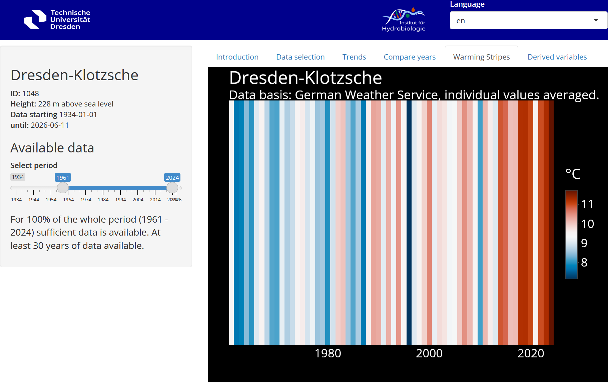

## {.title-page}

::::: title-slide-header
{.logo-left}

{.logo-right}
:::::

::::: title-slide-body
:::: title-slide-left

[Playful Teaching<br> of Simulation Models:<br> From Monolithic Shiny Apps to Quarto Dashboards and webR]{.big-title}

[Thomas Petzoldt and<br> Johannes Feldbauer]{.blue}

::::

:::: title-slide-right
{.title-illustration-img}
::::
:::::

<style>
/* Target the fenced block's container and inner code elements */
.blue-code-block .sourceCode, 
.blue-code-block pre, 
.blue-code-block code {
  background-color: #e0f2fe !important;
  color: #0369a1 !important;
}

/* add blue frame around inline figures */
.reveal section img.framed {
  border: 2px solid #e0f2fe !important;
  padding: 4px;
  border-radius: 4px;
  background-color: #ffffff;
}
</style>


# The Teaching Challenge


## Increasing Complexity $\longrightarrow$ Cross-Disciplinary Skills

<br>

<!--

$\Rightarrow$ Modeling and data science became an important part of almost every field.
<br>

-->


**Demand in Research and Engineering**

* people who can [use]{.cyan} computers
* people who can [understand]{.cyan} models
* people who are able to [develop]{.cyan} models

**School Experience** 

* [mathematics]{.neongreen} is complicated
* [programming]{.neongreen} is something for nerds 
* differential [calculus]{.neongreen} is rocket science

**Domain knowledge** 

<!-- channge this if for another conference -->
* Aquatic ecology, in my case 😉


## Use of Web-based Apps with Shiny

<br>

**Applications**

* Understanding of statistical concepts
* Analysis of experimental data
* Exploration of dynamic systems: growth, predator-prey, chaos
* Complex ecological models: Cyanobacteria in lakes


**Advantages**

* Interactivity: Playful exploration of data and models
* Data: Direct access to test cases and real world data
* Algorithms: full **R** ecosystem available

→ No installation hurdles, no Excel debugging

<br>

<!--
## Use Project Communication and Teaching

<br>
<br>

**For example**

* Students of Aquatic Ecology, Hydroscience and Engineering
* People, interested in the **facts** of climate warming
* Participants of an ecological conference
* Reservoir management professionals
* Students who want to become high-school teachers
* School kids ... and their parents

--->

## Example 1: Lake Profile Plotter

<br></br>

::: {.column width="49%"}
* Analysis of multiparameter probe data
* Limited time, avoid technical distractiona
* Concentrate on scientific background and data interpretation
:::

::: {.column width="50%"}
](img/lakeplot.png){.framed}
:::


## Example 2: Climate Data Explorer


<br></br>

::: {.column width="33%"}

<br></br>

* Visualisation of climate data and trends
* Data retrieval from the [German Weather Service](https://www.dwd.de)
* Used in teaching and for public outreach
:::

::: {.column width="66%"}
](img/dwd-trends.png){.framed}
:::

## Example 3: Reservoir Management Model

<br></br>

::: {.column width="33%"}

<br></br>

Influence of Climate Warming on Water Availability from Drinking Water Reservoirs

* Hydrophysical model [GOTM](https://gotm.net/) provided as web service
* Predefined scenarios
* Quick performance
* Results can be downloaded
:::

::: {.column width="66%"}
](img/gotm-app.png){.framed}
:::


# 

[Are we happy with this?]{.hugefont}

::: {.fragment .fade-up}
[No]{.hugefont}
:::

## "Classical" Shiny Apps

<br><br>

**Technical Fragmentation: Zoo of Apps**

* Server load, security, and OS updates
* Regular updates and maintenance required
* Each app has unique dependencies and design philosophy


<br>

**Didactical:  Media Fragmentation**

* Small apps: Limited complexity, self-explanatory but shallow
* Complex apps: 
    - High development effort, 
    - Require additional explanations (e.g., handouts)
* Storyboards: Linear, more focused on presentation than active learning


# Approach

## Step 1: Seamless Integration of Code and Docs

<br>


::: {.column width="49%"}
**App to teach essential growth models**

- By example of a food-web in a lake
- Eextensive textual information included

**Target groups**

- Aquatic ecology students
- Highschool students (11th year)
- Future biology teachers

**Implementation**

* Document-centric approach in form of a Quarto dashboard.


:::


::: {.column width="50%"}
](img/simbiose-w-title.png){.framed}
:::


<!------------------------------------------------------------------------------>
## Quarto Structure Example


::: {.column width="49%"}

<br>

**Outline with repeated elements**

- Caption hierarchy defines dashboard structure
- Top Menu
- Cards and Tabs

**Modular and extensible**

- Separate code and text files
- Independent testing and debugging
- Easy translation
- Adaptible for different audiences

:::


:::: {.column width="49%"}
::: {.blue-code-block}

```markdown
# Exponential Growth

## Description

::: {.panel-tabset width="38%"}

### Example

{}

### The Model

{}

### Tasks

{}

### Hints

{}

### Read More

{}

::: <!-- end tab set --->

<!-- contains code for 2 columns: widgets + graphics --->
{}

# Limited Growth

## Description

...

# Nutrient Limited Growth

...

# Predator-Prey Model

...

```
:::

::::

<!----------------------------------------------------------------------------->
  
  
## Example: Predator-Prey Model


<br></br>


::: {.column width="50%"}

**Unified UI**

- Top-hierarchy as Quarto document
- → Minimalistic to reduce user confusion

**Integrated Design**

- Narrative + interaction + graphics
- → Suitable for self-directed learning
  
**Modular Structure**

- Separate files allow easier updates
- Scalable and maintainable
  
:::


::: {.column width="50%"}
](img/simbiose-w-lv.png){.framed}
:::


## Demo

<br><br>

::: {.column width="50%"}

Each section has a **Description**, organized as **Panel Tabset**:

- Example: Introduction and real-world scenario
- The Model: Explanation of processes and equations
- Tasks: Exercises to explore model dynamics
- Hints: Guidance for solving tasks
- Read More: Links to resources or references

The **Widgets and Graphics** card integrates Shiny code to create interactive controls and visualization in a two-column layout.

:::

::: {.column width="50%"}

](img/simbiose-w-lv.png){.framed}
:::


# Step 2: "Serverless" Deployment

## WebR -- R in the Browser

<br><br>

**Avoids Specialized Shiny Server**

<br>

- Convert Shiny app with **shinylive**[^shinylive] into standalone **WebR**[^webR]-Apps
- Uses **WebAssembly**[^WebAssembly] to run R and the app entirely in the browser
- Deployment: No R server or Shiny server is required

[^shinylive]: [https://posit-dev.github.io/r-shinylive/](https://posit-dev.github.io/r-shinylive/)
[^webR]: [https://docs.r-wasm.org/webr/](https://docs.r-wasm.org/webr/)
[^WebAssembly]: [https://webassembly.org/](https://webassembly.org/)

## Prerequisites

- Python, numpy, pandas, shinylive, jupyter
- R, shiny, shinylive, quarto, reticulate
- Quarto + shinylive-extension

**Conversion to shinylive**

::: {.blue-code-block}
```{r eval=FALSE, echo=TRUE}
library(reticulate)
library(quarto)
reticulate::use_virtualenv("~/shinylive-env", required = TRUE)
system("quarto add quarto-ext/shinylive --no-prompt")
shinylive::assets_download() # recommended, otherwise 1st time automatically

quarto::quarto_render("simbiose-w.qmd")
```
:::

<br>

* Linux: straightforward
* Windows: good experience with miniconda
* Installation issues like download timeout, environment variables and long path names are solvable.


## Advantages and Challenges of Web-R

<br>

**Advantages**

- Runs on any web server, including static ones
- No need for a dedicated Shiny server

**Challenges**

- **Startup delay**: All required packages must be loaded from the web
- **Package availability**: Some R packages, like **deSolve**, are not compatible with Web-R

**Solution**

- Simplify code and reduce dependencies
- Use **base graphics** instead of heavier packages like **ggplot2**
- Implement a standalone ODE45 solver in pure R to replace unavailable packages

## Demo


](img/simbiose-w-title-shinylive.png){.framed}


# Conclusions

---

## Pros and Cons

<br>

:::{.smallfont}

| **Property**                          | **Complex Shiny Apps**                                                                                   | **Quarto Dashboards with Shiny**                                                                               | **Shinylive Apps**                                                                                      |
|---------------------------------------|----------------------------------------------------------------------------------------------------------|----------------------------------------------------------------------------------------------------------------|---------------------------------------------------------------------------------------------------------|
| **Full Power of R**                   | Full access to R's capabilities, including compiled code.                         | Full access to R's capabilities, including compiled code.          | Supports WASM-compatible R packages and user-level code.              |
| **Implementation**           | [Full flexibility, supports backend code (e.g. compiled binaries) and database access.]{.neongreen}        | Flexible and [consistent layout]{.neongreen}; supports backends and database access. | [Runs entirely in the browser]{.neongreen}, no backend or database access, startup delay.                       |
| **Ease of Implementation**            | Requires significant expertise in Shiny, R, and web development, especially for maintenance.             | Easy to implement and maintain; [Quarto simplifies layout and integration.]{.neongreen}                                      | [Easy to implement, no server setup required, apps can be deployed as static files.]{.neongreen}                   |
| **Server Infrastructure**             | Requires Shiny Server or Posit Connect for deployment. May need scaling of CPU and memory.               | Requires Shiny Server or Posit Connect for deployment. May need scaling of CPU and memory | [Scales effortlessly as apps run entirely in the browser.]{.neongreen}                            |
| **Integration of Code and Tutorials** | [Allows complex applications]{.neongreen}, but may require external tutorials or handouts.                      | [Integration of code, text, and interactivity in a single document]{.neongreen}; ideal for teaching.                | [No dependency on specific maintainer and server provider]{.neongreen}; excellent for didactic purposes. |

:::


## Summary

1. **Complex Shiny Apps**
    - For complex applications requiring backend integration, databases, etc.
    - High flexibility but significant technical and implementation overhead.

2. **Quarto Dashboards with Shiny**
    - Balance between complexity and ease of use.
    - Text, visualization, and interactivity in a single document.

3. **Shinylive Apps**
    - Best for lightweight applications that run entirely in the browser.
    - Ensures longevity of tutorials, independent of external hosting, no CPU scaling issues.
    
4. [**Dashboards with Shinylive**]{.highlight}
    - Combines advantages of Quarto Dashboards and Shinylive.
    - A highly appealing approach for teaching apps of medium complexity.
    
## Acknowledgments

::: {.column width="70%"}

<br>

* Luisa Henze, Monique Meier, Thomas Berendonk
* Digital Learning and Teaching Fund of TU Dresden [[link]](https://tu-dresden.de/zill/foerdermoeglichkeiten/fondsdll)

{height=80}
{height=100}

<br>

**The R Community**

{height=100}

:::

::: {.column width="30%"}


:::

#

{height=100}

[https://github.com/tpetzoldt/useR2026/](https://github.com/tpetzoldt/useR2026/)


 

This work is licensed under the Creative Commons License [CC-BY 4.0 ](https://creativecommons.org/licenses/by/4.0/) 
