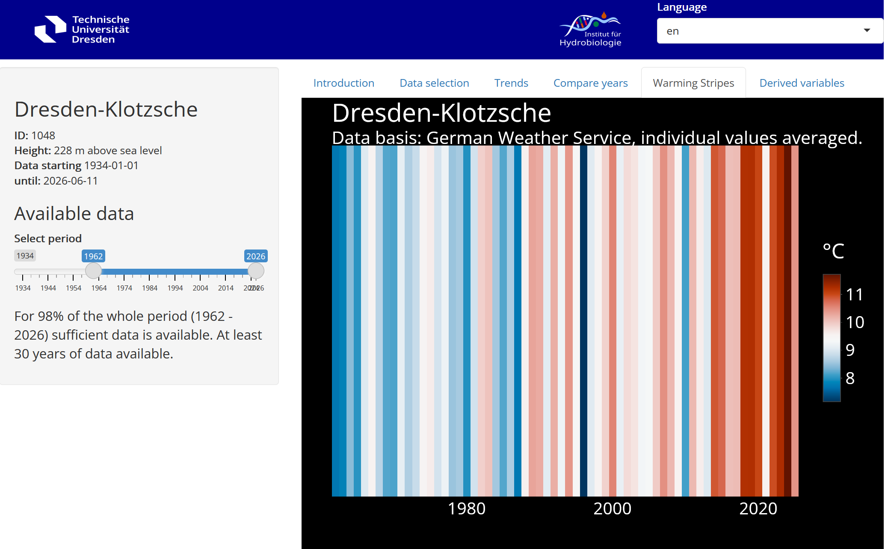

## {.title-page}

::::: title-slide-header
{.logo-left}

{.logo-right}
:::::

::::: title-slide-body
:::: title-slide-left

[Playful Teaching  of Simulation Models:  From Monolithic Shiny Apps to Quarto Dashboards and webR]{.big-title}

[Thomas Petzoldt and  Johannes Feldbauer]{.blue}

::::

:::: title-slide-right
{.title-illustration-img}
::::
:::::

# Headline Slide

## First Content Slide

Content here...

* lorem ipsum
* foo foo bar bar bar

